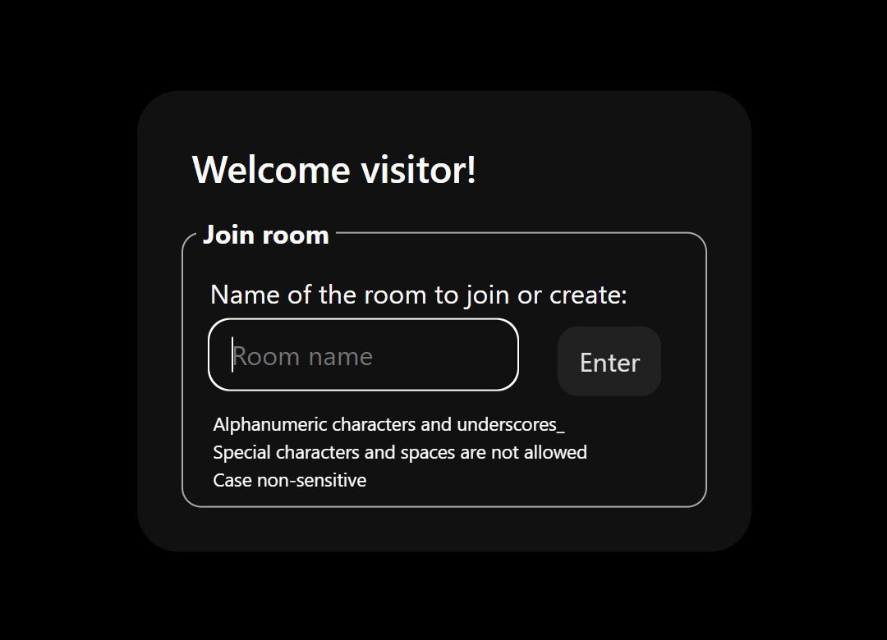

# media-room (wip-v0.4)

A minimal and responsive media chat room using [Ably.io](https://ably.com/)

## Installation

1) ### Clone the repository

    ~~~~
    git clone https://github.com/realjck/media-room.git
    ~~~~

2) ### Get your Api Key

    Visit [Ably.io](https://ably.io) to sign up, create a project, retrieve your API key.

3) ### Setting Up Configuration for API Key

    Create a file named `settings` within a `./config/` folder and input your API key using the format `API_KEY=_____`

    ~~~~
    mkdir config
    echo "API_KEY=_____" > config/settings
    ~~~~

## Usage

Ensure that the `index.html` page is served to launch.

When launched, the application display a modal to connect to the room:

## MIT License

